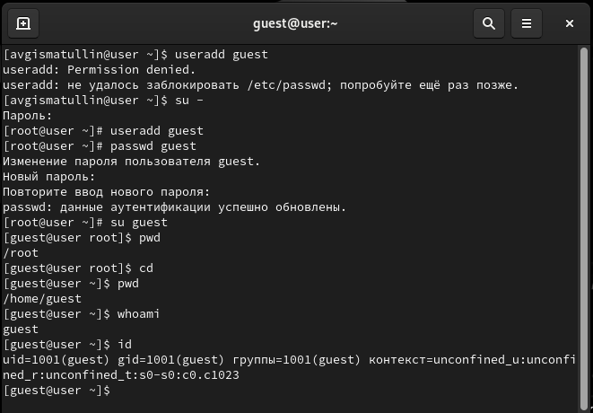
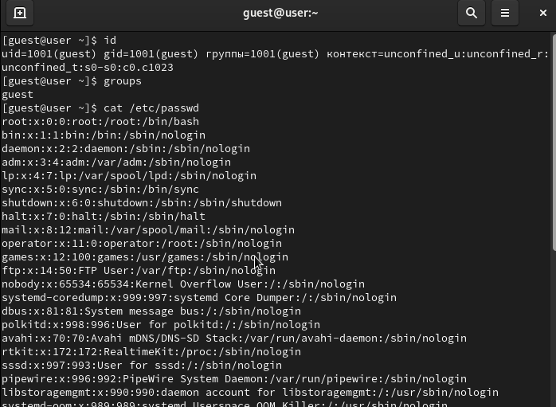
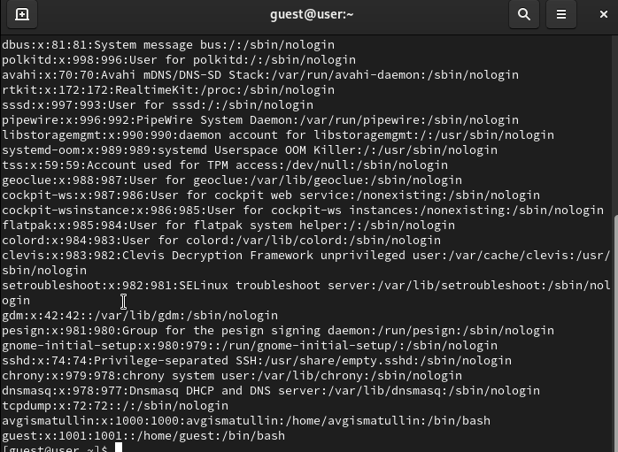
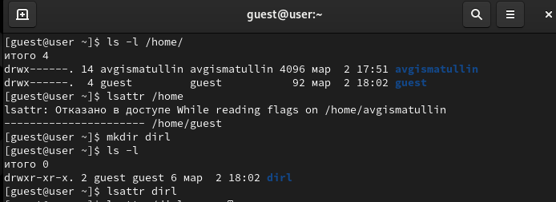
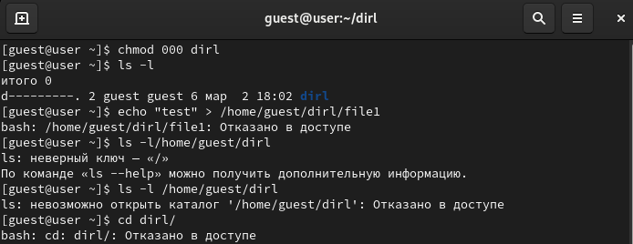
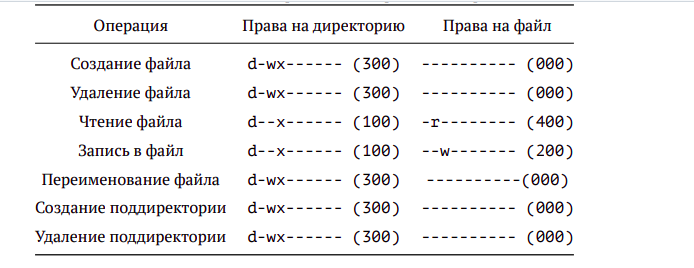

---
## Front matter
lang: ru-RU
title: Лабораторная работа №2
subtitle: Дискреционное разграничение прав Linux
author:
  - Гисматуллин А.В.
institute:
  - Российский университет дружбы народов, Москва, Россия

## i18n babel
babel-lang: russian
babel-otherlangs: english

## Formatting pdf
toc: false
toc-title: Содержание
slide_level: 2
aspectratio: 169
section-titles: true
theme: metropolis
header-includes:
 - \metroset{progressbar=frametitle,sectionpage=progressbar,numbering=fraction}
 - '\makeatletter'
 - '\beamer@ignorenonframefalse'
 - '\makeatother'
 
## Fonts
mainfont: PT Serif
romanfont: PT Serif
sansfont: PT Sans
monofont: PT Mono
mainfontoptions: Ligatures=TeX
romanfontoptions: Ligatures=TeX
sansfontoptions: Ligatures=TeX,Scale=MatchLowercase
monofontoptions: Scale=MatchLowercase,Scale=0.9
---

## Цели и задачи

- Получение практических навыков работы в консоли с атрибутами файлов
- Закрепление теоретических основ дискреционного разграничения доступа в современных системах с открытым кодом на базе ОС Linux

# Процесс выполнения лабораторной работы

## Создание пользователя и определение его uid и группы

{ #fig:001 width=70%, height=70% }

## Сравнение id и groups

{ #fig:002 width=70%, height=70% }

## Файл /etc/passwd

{ #fig:003 width=70%, height=70% }

## Команды ls -a

{ #fig:004 width=70%, height=70% }

## Снятие дистрибутов

{ #fig:005 width=70%, height=70% }

## Права на директорию и файл

{ #fig:006 width=70%, height=70% }

# Выводы по проделанной работе

В ходе выполнения данной лабораторной работы были получены практические навыки работы в консоли с атрибутами файлов, закреплены теоретических основ дискреционного разграничения доступа в современных системах с открытым кодом на базе ОС Linux1.

