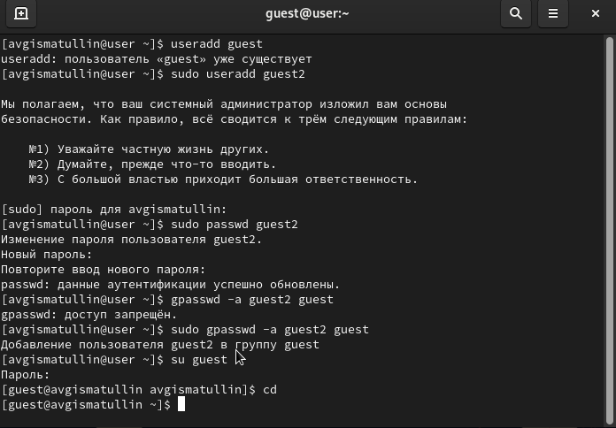
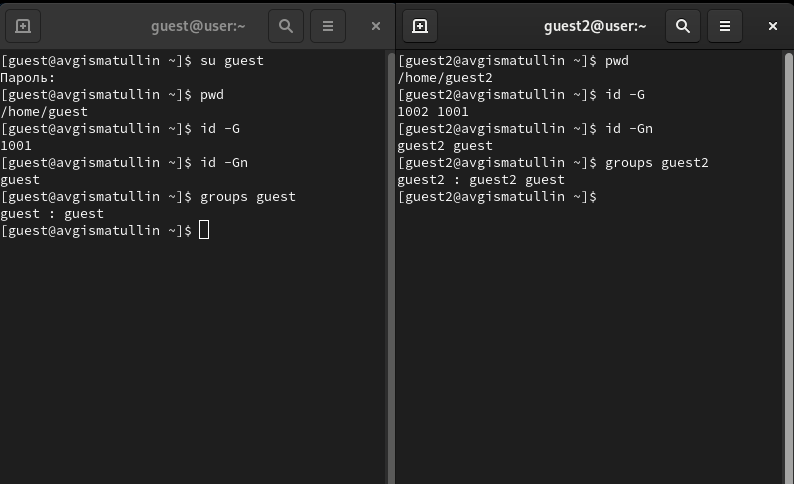
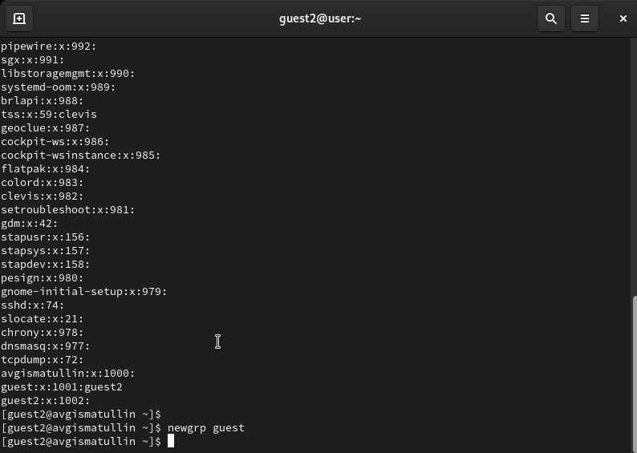
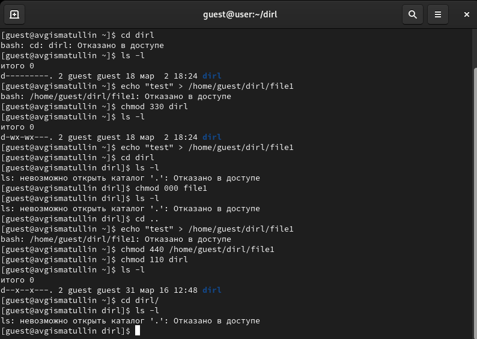

---
## Front matter
title: "Отчет по лабораторной работе №3"
subtitle: "Дискреционное разграничение прав Linux для групп пользователей"
author: "Гисматуллин Артём Вадимович НПИбд-01-22"

## Generic otions
lang: ru-RU
toc-title: "Содержание"

## Bibliography
bibliography: bib/cite.bib
csl: pandoc/csl/gost-r-7-0-5-2008-numeric.csl

## Pdf output format
toc: true # Table of contents
toc-depth: 2
lof: true # List of figures
lot: true # List of tables
fontsize: 12pt
linestretch: 1.5
papersize: a4
documentclass: scrreprt
## I18n polyglossia
polyglossia-lang:
  name: russian
  options:
	- spelling=modern
	- babelshorthands=true
polyglossia-otherlangs:
  name: english
## I18n babel
babel-lang: russian
babel-otherlangs: english
## Fonts
mainfont: PT Serif
romanfont: PT Serif
sansfont: PT Sans
monofont: PT Mono
mainfontoptions: Ligatures=TeX
romanfontoptions: Ligatures=TeX
sansfontoptions: Ligatures=TeX,Scale=MatchLowercase
monofontoptions: Scale=MatchLowercase,Scale=0.9
## Biblatex
biblatex: true
biblio-style: "gost-numeric"
biblatexoptions:
  - parentracker=true
  - backend=biber
  - hyperref=auto
  - language=auto
  - autolang=other*
  - citestyle=gost-numeric
## Pandoc-crossref LaTeX customization
figureTitle: "Рис."
tableTitle: "Таблица"
listingTitle: "Листинг"
lofTitle: "Список иллюстраций"
lotTitle: "Список таблиц"
lolTitle: "Листинги"
## Misc options
indent: true
header-includes:
  - \usepackage{indentfirst}
  - \usepackage{float} # keep figures where there are in the text
  - \floatplacement{figure}{H} # keep figures where there are in the text
---

# Цель работы

Получение практических навыков работы в консоли с атрибутами файлов для групп пользователей

# Задание

Последовательно выполнять все пункты, занося ответы и замечания в отчет.

# Выполнение лабораторной работы

1. Создадим пользователя guest, зададим ему пароль и войдем под этим именем в систему через команду su guest. Сделаем то же самое с пользователем guest2. Далее добавим пользователя guest2 в группу guest командой gpasswd -a и осуществим вход в систему от двух пользователей с двух консолей (рис. [-@fig:001])

{ #fig:001 width=70%, height=70% }

2. После этого выведем настоящую директорию командой pwd, уточним имя пользователя, в каких группах они состоят и сравним вывод команды groups с выводом id -Gn и id -G (рис. [-@fig:002])

{ #fig:002 width=70%, height=70% }

3. Через пользователя guest2 выведем данные командой cat /etc/group, чтобы сравнить всю информацию с содержимым этого файла (рис. [-@fig:003])

{ #fig:003 width=70%, height=70% }

Здесь же выполним регистрацию пользователя guest2 в группе guest командой - newgrp guest

4. При помощи команды chmod g+rwx /home/guest изменим права директории, разрешив все действия для пользователей группы и начнем заполнять таблицу "Минимальные права для совершения операций от имени пользователей, входящих в группу" (рис. [-@fig:004])

{ #fig:004 width=70%, height=70% }

5. Заполним здесь же предыдущую таблицу "Установленные права и разрешенные действия" [-@tbl:rig-act], где "+" и "-" - знак того, разрешена или нет операция.

Здесь каждый параметр обозначает следующее:

1 - Создание файла

2 - Удаление файла

3 - Запись в файл

4 - Чтение в файл

5 - Смена директории

6 - Просмотр файлов в директории

7 - Переименовывание файла

8 - Смена атрибутов файла

: Установленные права и разрешенные действия {#tbl:rig-act}

|Права директории|Права файла|1|2|3|4|5|6|7|8|
|:---|:---|---|---|---|---|---|---|---|---|
|```d---------(000)```|```----------(000)```|-|-|-|-|-|-|-|-|
|```d--x------(100)```|```----------(000)```|-|-|-|-|+|-|-|+|
|```d-w-------(200)```|```----------(000)```|-|-|-|-|-|-|-|-|
|```d-wx------(300)```|```----------(000)```|+|+|-|-|+|-|+|+|
|```dr--------(400)```|```----------(000)```|-|-|-|-|-|-|-|-|
|```dr-x------(500)```|```----------(000)```|-|-|-|-|+|+|-|+|
|```drw-------(600)```|```----------(000)```|-|-|-|-|-|-|-|-|
|```drwx------(700)```|```----------(000)```|+|+|-|-|+|+|+|+|
|```d---------(000)```|```---x------(100)```|-|-|-|-|-|-|-|-|
|```d--x------(100)```|```---x------(100)```|-|-|-|-|+|-|-|+|
|```d-w-------(200)```|```---x------(100)```|-|-|-|-|-|-|-|-|
|```d-wx------(300)```|```---x------(100)```|+|+|-|-|+|-|+|+|
|```dr--------(400)```|```---x------(100)```|-|-|-|-|-|-|-|-|
|```dr-x------(500)```|```---x------(100)```|-|-|-|-|+|+|-|+|
|```drw-------(600)```|```---x------(100)```|-|-|-|-|-|-|-|-|
|```drwx------(700)```|```---x------(100)```|+|+|-|-|+|+|+|+|
|```d---------(000)```|```--w-------(200)```|-|-|-|-|-|-|-|-|
|```d--x------(100)```|```--w-------(200)```|-|-|+|-|+|-|-|+|
|```d-w-------(200)```|```--w-------(200)```|-|-|-|-|-|-|-|-|
|```d-wx------(300)```|```--w-------(200)```|+|+|+|-|+|-|+|+|
|```dr--------(400)```|```--w-------(200)```|-|-|-|-|-|-|-|-|
|```dr-x------(500)```|```--w-------(200)```|-|-|+|-|+|+|-|+|
|```drw-------(600)```|```--w-------(200)```|-|-|-|-|-|-|-|-|
|```drwx------(700)```|```--w-------(200)```|+|+|+|-|+|+|+|+|
|```d---------(000)```|```--wx------(300)```|-|-|-|-|-|-|-|-|
|```d--x------(100)```|```--wx------(300)```|-|-|+|-|+|-|-|+|
|```d-w-------(200)```|```--wx------(300)```|-|-|-|-|-|-|-|-|
|```d-wx------(300)```|```--wx------(300)```|+|+|+|-|+|-|+|+|
|```dr--------(400)```|```--wx------(300)```|-|-|-|-|-|-|-|-|
|```dr-x------(500)```|```--wx------(300)```|-|-|+|-|+|+|-|+|
|```drw-------(600)```|```--wx------(300)```|-|-|-|-|-|-|-|-|
|```drwx------(700)```|```--wx------(300)```|+|+|+|-|+|+|+|+|
|```d---------(000)```|```-r--------(400)```|-|-|-|-|-|-|-|-|
|```d--x------(100)```|```-r--------(400)```|-|-|-|+|+|-|-|+|
|```d-w-------(200)```|```-r--------(400)```|-|-|-|-|-|-|-|-|
|```d-wx------(300)```|```-r--------(400)```|+|+|-|+|+|-|+|+|
|```dr--------(400)```|```-r--------(400)```|-|-|-|-|-|-|-|-|
|```dr-x------(500)```|```-r--------(400)```|-|-|-|+|+|+|-|+|
|```drw-------(600)```|```-r--------(400)```|-|-|-|-|-|-|-|-|
|```drwx------(700)```|```-r--------(400)```|+|+|-|+|+|+|+|+|
|```d---------(000)```|```-r-x------(500)```|-|-|-|-|-|-|-|-|
|```d--x------(100)```|```-r-x------(500)```|-|-|-|+|+|-|-|+|
|```d-w-------(200)```|```-r-x------(500)```|-|-|-|-|-|-|-|-|
|```d-wx------(300)```|```-r-x------(500)```|+|+|-|+|+|-|+|+|
|```dr--------(400)```|```-r-x------(500)```|-|-|-|-|-|-|-|-|
|```dr-x------(500)```|```-r-x------(500)```|-|-|-|+|+|+|-|+|
|```drw-------(600)```|```-r-x------(500)```|-|-|-|-|-|-|-|-|
|```drwx------(700)```|```-r-x------(500)```|+|+|-|+|+|+|+|+|
|```d---------(000)```|```-rw-------(600)```|-|-|-|-|-|-|-|-|
|```d--x------(100)```|```-rw-------(600)```|-|-|+|+|+|-|-|+|
|```d-w-------(200)```|```-rw-------(600)```|-|-|-|-|-|-|-|-|
|```d-wx------(300)```|```-rw-------(600)```|+|+|+|+|+|-|+|+|
|```dr--------(400)```|```-rw-------(600)```|-|-|-|-|-|-|-|-|
|```dr-x------(500)```|```-rw-------(600)```|-|-|+|+|+|+|-|+|
|```drw-------(600)```|```-rw-------(600)```|-|-|-|-|-|-|-|-|
|```drwx------(700)```|```-rw-------(600)```|+|+|+|+|+|+|+|+|
|```d---------(000)```|```-rwx------(700)```|-|-|-|-|-|-|-|-|
|```d--x------(100)```|```-rwx------(700)```|-|-|+|+|+|-|-|+|
|```d-w-------(200)```|```-rwx------(700)```|-|-|-|-|-|-|-|-|
|```d-wx------(300)```|```-rwx------(700)```|+|+|+|+|+|-|+|+|
|```dr--------(400)```|```-rwx------(700)```|-|-|-|-|-|-|-|-|
|```dr-x------(500)```|```-rwx------(700)```|-|-|+|+|+|+|-|+|
|```drw-------(600)```|```-rwx------(700)```|-|-|-|-|-|-|-|-|
|```drwx------(700)```|```-rwx------(700)```|+|+|+|+|+|+|+|+|

На основании заполненной таблицы выше определили минимально необходимые права для выполнения операций пользователем guest2 внутри директории dir1 и заполнили таблицу [-@tbl:min-rig]. Для заполнения последних двух строк опытным путем проверили минимальные права для различных манипуляций с файлами и директорией.

: Минимальные права для совершения операций {#tbl:min-rig}

|Операция|Права на директорию|Права на файл|
|:---:|:---:|:---:|
|Создание файла|```d-wx------ (300)```|```---------- (000)```|	    
|Удаление файла|```d-wx------ (300)```|```---------- (000)```|
|Чтение файла|```d--x------ (100)```|```-r-------- (400)```|
|Запись в файл|```d--x------ (100)```|```--w------- (200)```|
|Переименование файла|```d-wx------ (300)```|```----------(000)```|
|Создание поддиректории|```d-wx------ (300)```|```---------- (000)```|
|Удаление поддиректории|```d-wx------ (300)```|```---------- (000)```|

Из данных, полученных из таблицы, мы можем сделать вывод, что она схожа с таблицей из предыдущей работы. Разница лишь в том, что в предыдущий раз мы присваивали права владельцу, а в этот раз - группе.

# Выводы

В ходе выполнения данной лабораторной работы были получены практические навыки работы в консоли с атрибутами файлов для групп пользователей

# Список литературы{.unnumbered}

1. [Теория разграничения прав пользователей](https://moodle.kstu.ru/pluginfile.php/318215/mod_resource/content/1/Теория_разграничение_прав_пользователи.pdf)
2. [Разрешения доступа к файлам](https://linuxcommand.ru/razresheniya-dostupa-k-failam/)
