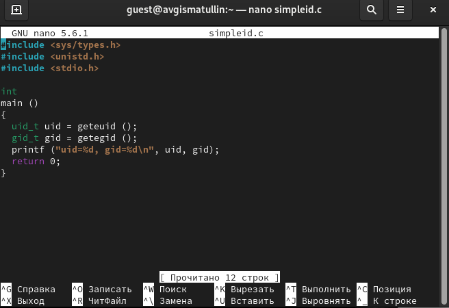
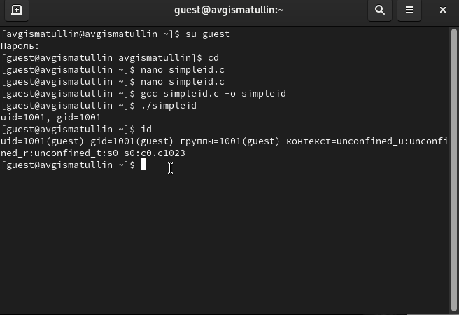
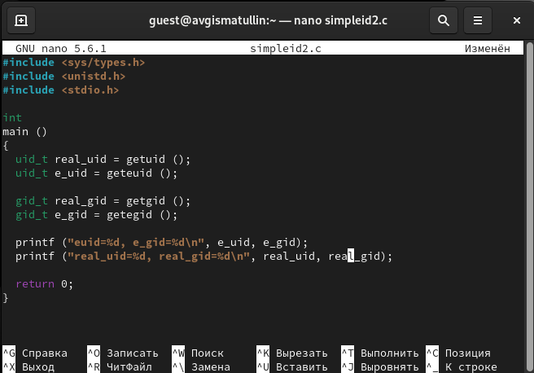
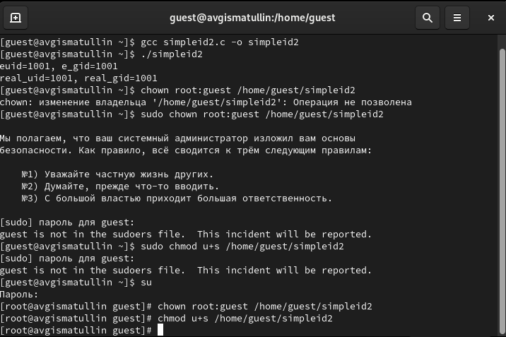
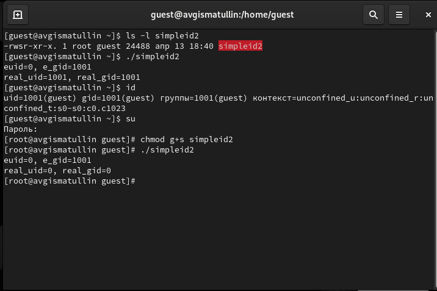
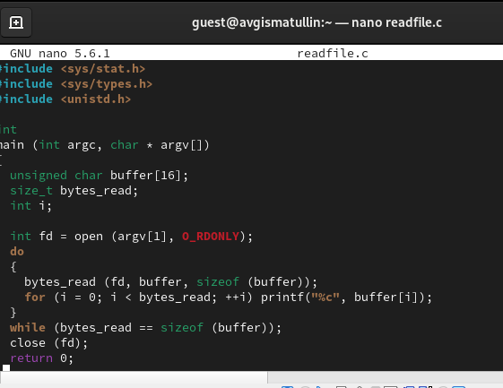
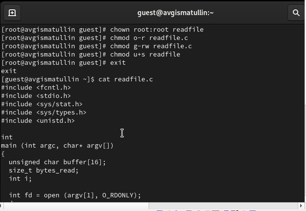
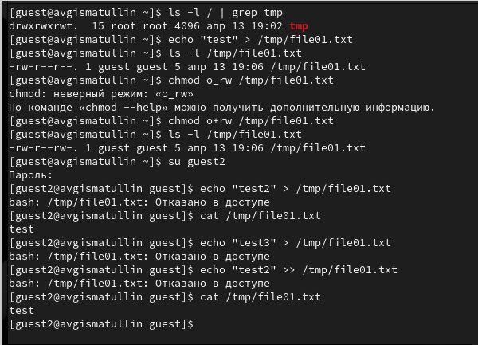
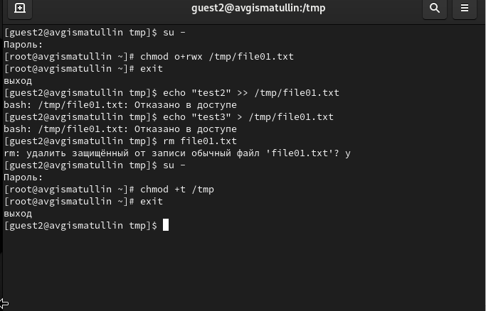

---
## Front matter
title: "Отчет по лабораторной работе №5"
subtitle: "Дискреционное разграничение прав Linux. Исследования влияния расширенных атрибутов"
author: "Гисматуллин Артём Вадимович НПИбд-01-22"

## Generic otions
lang: ru-RU
toc-title: "Содержание"

## Bibliography
bibliography: bib/cite.bib
csl: pandoc/csl/gost-r-7-0-5-2008-numeric.csl

## Pdf output format
toc: true # Table of contents
toc-depth: 2
lof: true # List of figures
lot: true # List of tables
fontsize: 12pt
linestretch: 1.5
papersize: a4
documentclass: scrreprt
## I18n polyglossia
polyglossia-lang:
  name: russian
  options:
	- spelling=modern
	- babelshorthands=true
polyglossia-otherlangs:
  name: english
## I18n babel
babel-lang: russian
babel-otherlangs: english
## Fonts
mainfont: PT Serif
romanfont: PT Serif
sansfont: PT Sans
monofont: PT Mono
mainfontoptions: Ligatures=TeX
romanfontoptions: Ligatures=TeX
sansfontoptions: Ligatures=TeX,Scale=MatchLowercase
monofontoptions: Scale=MatchLowercase,Scale=0.9
## Biblatex
biblatex: true
biblio-style: "gost-numeric"
biblatexoptions:
  - parentracker=true
  - backend=biber
  - hyperref=auto
  - language=auto
  - autolang=other*
  - citestyle=gost-numeric
## Pandoc-crossref LaTeX customization
figureTitle: "Рис."
tableTitle: "Таблица"
listingTitle: "Листинг"
lofTitle: "Список иллюстраций"
lotTitle: "Список таблиц"
lolTitle: "Листинги"
## Misc options
indent: true
header-includes:
  - \usepackage{indentfirst}
  - \usepackage{float} # keep figures where there are in the text
  - \floatplacement{figure}{H} # keep figures where there are in the text
---

# Цель работы

Изучение механизмов изменения идентификаторов, применения SetUID- и Sticky-битов. 
Получение практических навыков работы в консоли с дополнительными атрибутами. 
Рассмотрение работы механизма смены идентификатора процессов пользователей,
 а также влияние бита Sticky на запись и удаление файлов

# Задание

Последовательно выполнять все пункты, занося ответы и замечания в отчет.

# Выполнение лабораторной работы

## Создание программы
 
1. Зайдем под учетной записью guest и создадим первую программу под названием simpleid.c (рис. [-@fig:001])

{ #fig:001 width=70%, height=70% }

2. Скомпилируем программу командой gcc simplied.c -o simpleid, а затем выполним программу. Сравним с системным выводом id (рис. [-@fig:002])

{ #fig:002 width=70%, height=70% }

3. Далее создадим файл simpleid2.c и в дальнейшем скомпилируем его (рис. [-@fig:003])

{ #fig:003 width=70%, height=70% }

4. После этого (после компиляции) запустим его и пропишем команды по смене владельца файла simpleid2. При помощи команды ls -l simpleid2 проверим установку новых атрибутов и владельца, а затем сравним вывод программы simpleid2 и id. Заметим, что выводы отличаются (рис. [-@fig:004])

{ #fig:004 width=70%, height=70% }

В самом конце проделаем то же самое относительно SetGID-бита (рис. [-@fig:005])

{ #fig:005 width=70%, height=70% }

1. После этого пропишем эту программу (рис. [-@fig:006])

{ #fig:006 width=70%, height=70% }

После компиляции сменим владельца у файла readfile.c и поменяем права так, чтобы только root пользователь смог его прочитать, установим SetU'D-бит и, наконец, проверим, может ли программа readfile прочитать файл readfile.c (рис. [-@fig:007])

{ #fig:007 width=70%, height=70% }

## Исследование Stiky-бита

1. Начнем выполнение с того, что узнаем, есть ли атрибут Sticky на директории /tmp. От имени пользователя guest запием в файл file01.txt слово test, а затем разрешим для остальных пользователей читать и записывать этот файл. Заметим, что ни дописать, ни перезаписать, ни удалить этот файл мы с пользователем guest2 не можем (рис. [-@fig:008])

{ #fig:008 width=70%, height=70% }

2. Изменим расширенный атрибут t в директори /tmp и убедимся, что теперь мы можем удалить файл file01.txt (рис. [-@fig:009])

{ #fig:009 width=70%, height=70% }

# Выводы

В ходе выполнения данной лабораторной работы были изучены механизмы изменения идентификаторов, применения SetUID- и Sticky-битов. 
Получены практические навыки работы в консоли с дополнительными атрибутами. 
Рассмотрены работы механизма смены идентификатора процессов пользователей,
 а также влияние бита Sticky на запись и удаление файлов

# Список литературы{.unnumbered}

1. [Теория разграничения прав пользователей](https://moodle.kstu.ru/pluginfile.php/318215/mod_resource/content/1/Теория_разграничение_прав_пользователи.pdf)
2. [Разрешения доступа к файлам](https://linuxcommand.ru/razresheniya-dostupa-k-failam/)
