---
## Front matter
lang: ru-RU
title: Лабораторная работа №6
subtitle: Мандатное разграничение прав
author:
  - Гисматуллин А.В.
institute:
  - Российский университет дружбы народов, Москва, Россия

## i18n babel
babel-lang: russian
babel-otherlangs: english

## Formatting pdf
toc: false
toc-title: Содержание
slide_level: 2
aspectratio: 169
section-titles: true
theme: metropolis
header-includes:
 - \metroset{progressbar=frametitle,sectionpage=progressbar,numbering=fraction}
 - '\makeatletter'
 - '\beamer@ignorenonframefalse'
 - '\makeatother'
 
## Fonts
mainfont: PT Serif
romanfont: PT Serif
sansfont: PT Sans
monofont: PT Mono
mainfontoptions: Ligatures=TeX
romanfontoptions: Ligatures=TeX
sansfontoptions: Ligatures=TeX,Scale=MatchLowercase
monofontoptions: Scale=MatchLowercase,Scale=0.9
---

## Цели и задачи

 - Развить навыки администрирования ОС Linux. Получить первое практическое знакомство с технологией SELinux1.
 - Проверить работу SELinx на практике совместно с веб-сервером Apache.

# Процесс выполнения лабораторной работы

## Проверка сервера

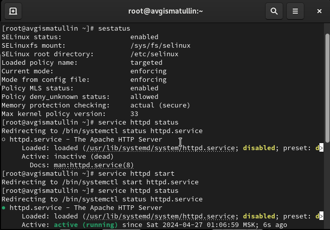{ #fig:001 width=70%, height=70% }

## Проверка сервера

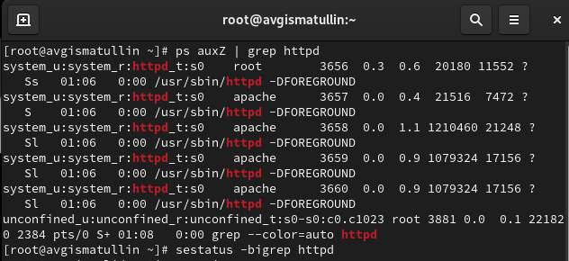{ #fig:002 width=70%, height=70% }

## Проверка сервера

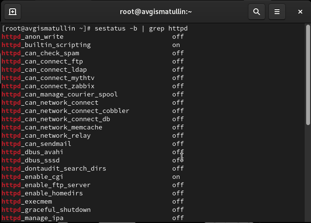{ #fig:003 width=70%, height=70% }

## Статистика о политике

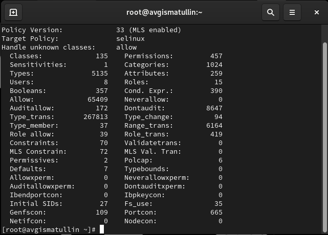{ #fig:004 width=70%, height=70% }

## Информация о файлах

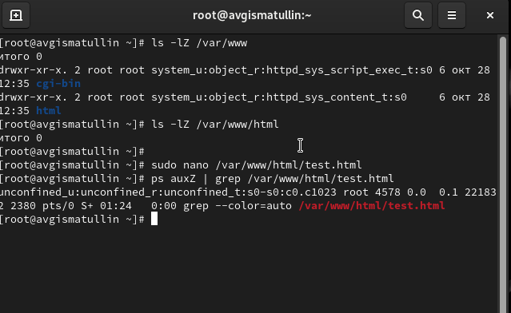{ #fig:005 width=70%, height=70% }

## Веб-сервер

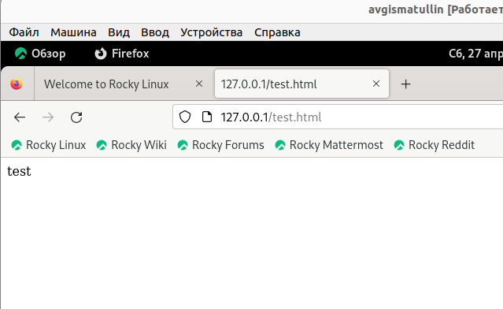{ #fig:006 width=70%, height=70% }

## Изменение контекста

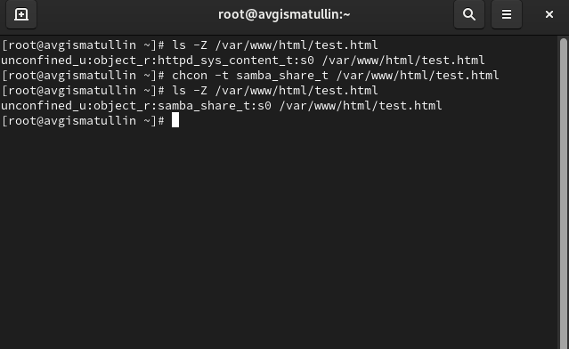{ #fig:007 width=70%, height=70% }

## Веб-сервер

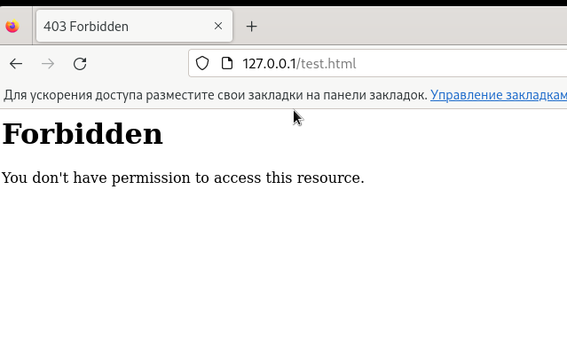{ #fig:008 width=70%, height=70% }

## log-файлы

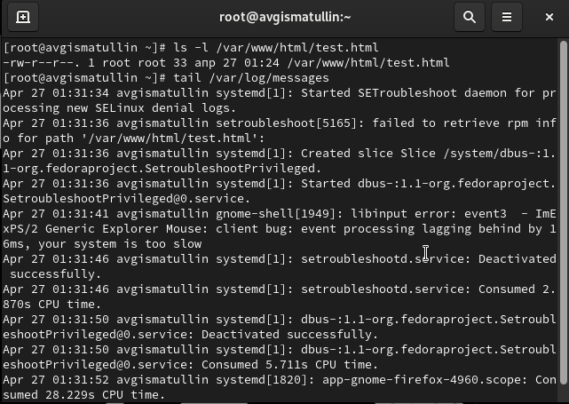{ #fig:009 width=70%, height=70% }

## Изменения файла

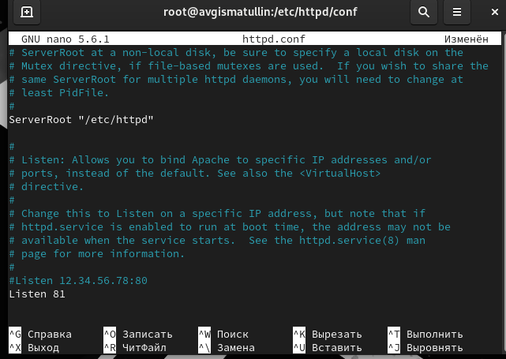{ #fig:010 width=70%, height=70% }

## Веб-сервер

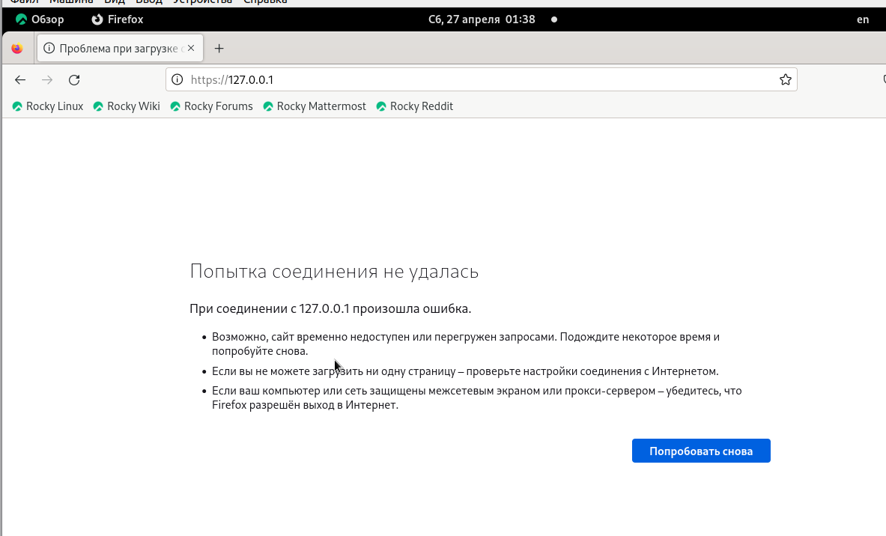{ #fig:011 width=70%, height=70% }

## Просмотр ошибок

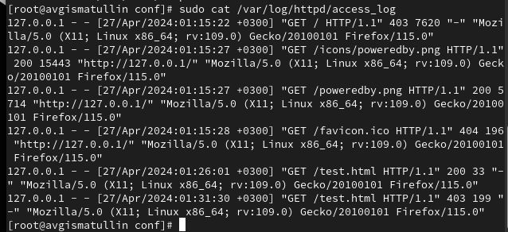{ #fig:012 width=70%, height=70% }

## Проверка изменений

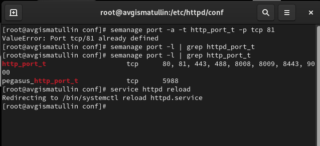{ #fig:013 width=70%, height=70% }

## Веб-сервер

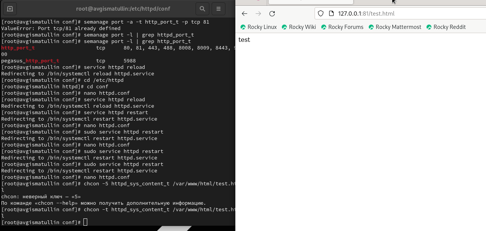{ #fig:014 width=70%, height=70% }

## Удаление компонентов

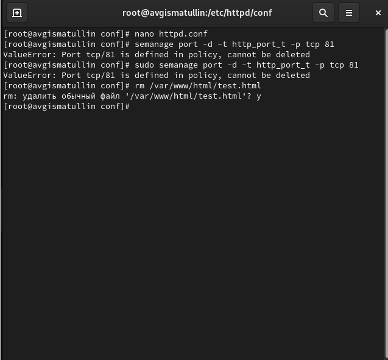{ #fig:015 width=70%, height=70% }

# Выводы по проделанной работе

В ходе выполнения данной лабораторной работы были развиты навыки администрирования ОС Linux, а также проверена работа SELinx на практике совместно с веб-сервером Apache.

