---
## Front matter
title: "Отчет по лабораторной работе №6"
subtitle: "Мандатное разграничение прав"
author: "Гисматуллин Артём Вадимович НПИбд-01-22"

## Generic otions
lang: ru-RU
toc-title: "Содержание"

## Bibliography
bibliography: bib/cite.bib
csl: pandoc/csl/gost-r-7-0-5-2008-numeric.csl

## Pdf output format
toc: true # Table of contents
toc-depth: 2
lof: true # List of figures
lot: true # List of tables
fontsize: 12pt
linestretch: 1.5
papersize: a4
documentclass: scrreprt
## I18n polyglossia
polyglossia-lang:
  name: russian
  options:
	- spelling=modern
	- babelshorthands=true
polyglossia-otherlangs:
  name: english
## I18n babel
babel-lang: russian
babel-otherlangs: english
## Fonts
mainfont: PT Serif
romanfont: PT Serif
sansfont: PT Sans
monofont: PT Mono
mainfontoptions: Ligatures=TeX
romanfontoptions: Ligatures=TeX
sansfontoptions: Ligatures=TeX,Scale=MatchLowercase
monofontoptions: Scale=MatchLowercase,Scale=0.9
## Biblatex
biblatex: true
biblio-style: "gost-numeric"
biblatexoptions:
  - parentracker=true
  - backend=biber
  - hyperref=auto
  - language=auto
  - autolang=other*
  - citestyle=gost-numeric
## Pandoc-crossref LaTeX customization
figureTitle: "Рис."
tableTitle: "Таблица"
listingTitle: "Листинг"
lofTitle: "Список иллюстраций"
lotTitle: "Список таблиц"
lolTitle: "Листинги"
## Misc options
indent: true
header-includes:
  - \usepackage{indentfirst}
  - \usepackage{float} # keep figures where there are in the text
  - \floatplacement{figure}{H} # keep figures where there are in the text
---

# Цель работы

 - Развить навыки администрирования ОС Linux. Получить первое практическое знакомство с технологией SELinux1.
 - Проверить работу SELinx на практике совместно с веб-сервером Apache.

# Задание

Последовательно выполнять все пункты, занося ответы и замечания в отчет.

# Выполнение лабораторной работы
 
1. После выполнения всех требований для данной лабораторной работы, обратимся к веб-серверу и убедимся, что он у нас успешно работает (команда service httpd status) (рис. [-@fig:001])

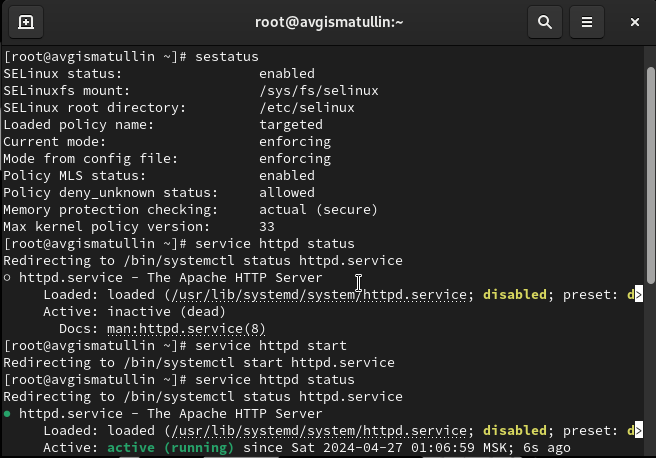{ #fig:001 width=70%, height=70% }

2. Найдем веб-сервер Apache  списке процессов и убедимся, что он доступен только для суперпользователей (рис. [-@fig:002])

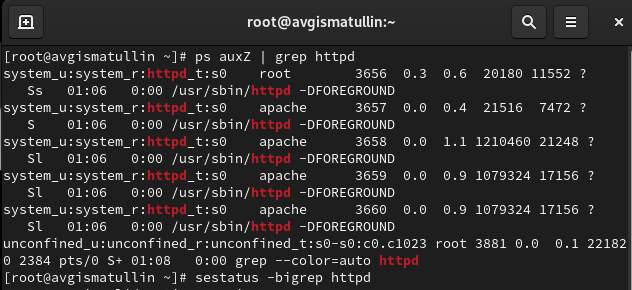{ #fig:002 width=70%, height=70% }

3. Далее командой sestatus -b | grep посмотрим текущее состояние переключателей SELinux для Apache (рис. [-@fig:003])

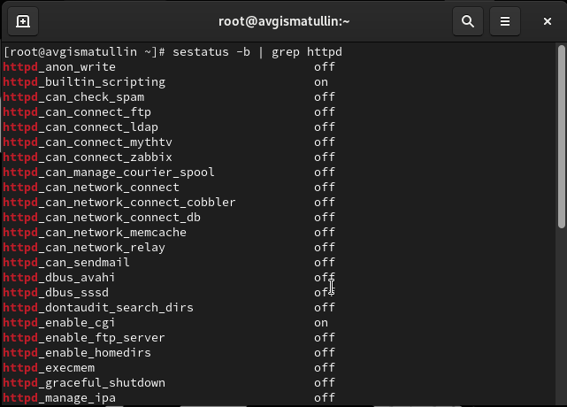{ #fig:003 width=70%, height=70% }

4. После этого при помощи команды seinfo посмотрим статистику по политике, определим множество пользователей, ролей и типов (рис. [-@fig:004])

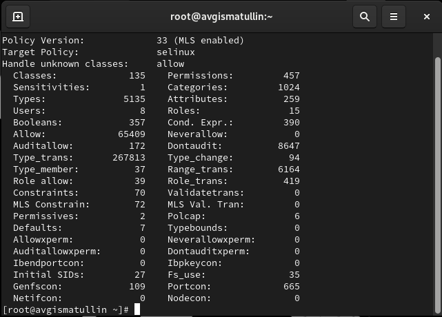{ #fig:004 width=70%, height=70% }

5. Затем опеределим тип файлов в директории /var/www и /var/www/html, создадим файл test.html с выводом в теле слова "test" и проверим его контекст (рис. [-@fig:005])

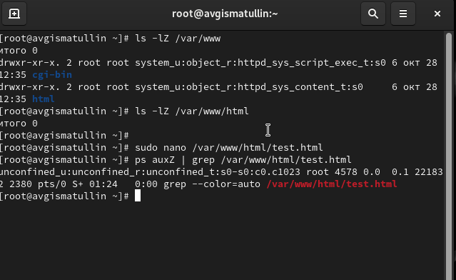{ #fig:005 width=70%, height=70% }

6. После этого Зайдем по локальному адресу и проверим работоспособность сервера (рис. [-@fig:006])

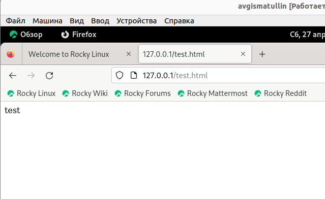{ #fig:006 width=70%, height=70% }

7. Мы можем успешно изменять контекст файла командой chcon. Сделаем это, прописав samba_share_t (рис. [-@fig:007])

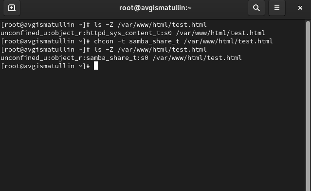{ #fig:007 width=70%, height=70% }

8. Как видим, доступ к файлу через веб-сервер мы потеряли (рис. [-@fig:008])

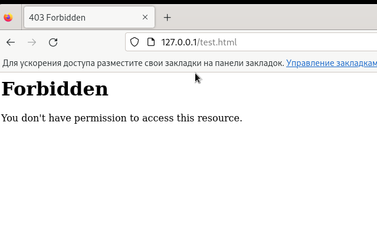{ #fig:008 width=70%, height=70% }

9. Проанализируем атрибуты файла, а также log-файлы веб-сервера. Оказалось, что там запущены setroubleshootd процессы (рис. [-@fig:009])

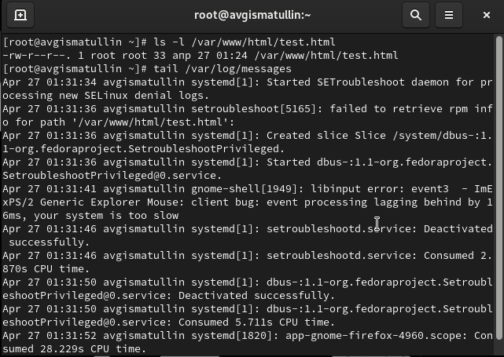{ #fig:009 width=70%, height=70% }

10. Попробуем запустить веб-сервер на прослушивание TCP-орта 81, а не 80, как было ранее, изменив соответствующий параметр в конфигурационном файле (рис. [-@fig:010])

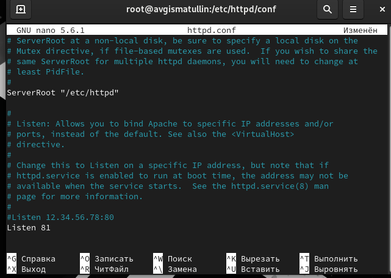{ #fig:010 width=70%, height=70% }

11. Обнаружилось, что доступ к сайту мы потеряли. Сервер не готов прослушивать нас на этом порте (рис. [-@fig:011])

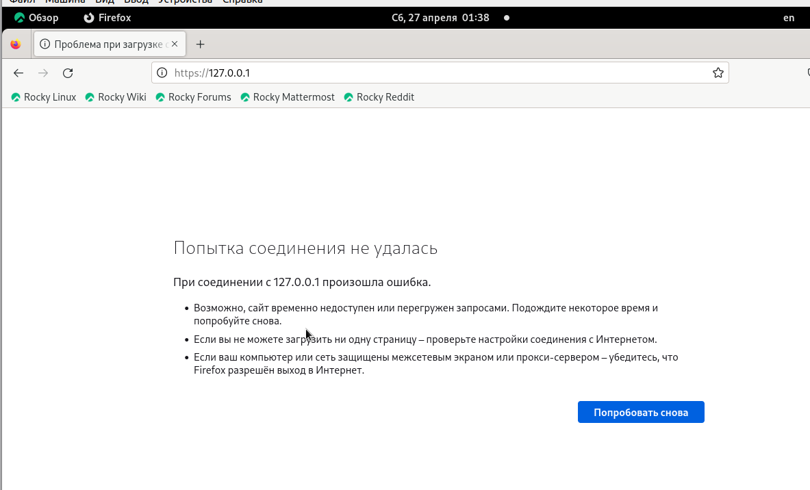{ #fig:011 width=70%, height=70% }

12. Проанализируем ошибки, посмотрим лог файлы и проследим за полученными запросами серверу (рис. [-@fig:012])

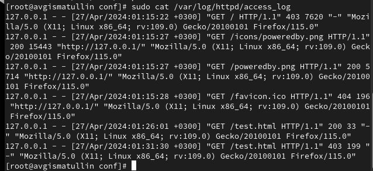{ #fig:012 width=70%, height=70% }

13. Выполним команду semanage port -a -t http_port_t -p tcp 81 и проверим изменения (рис. [-@fig:013])

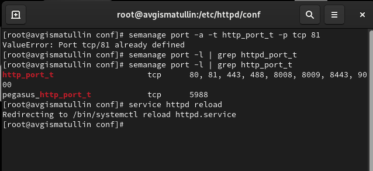{ #fig:013 width=70%, height=70% }

14. Перезапустим сервер и попробуем запустить его после изменения контекста обратно, а также указания порта 81 (рис. [-@fig:014])

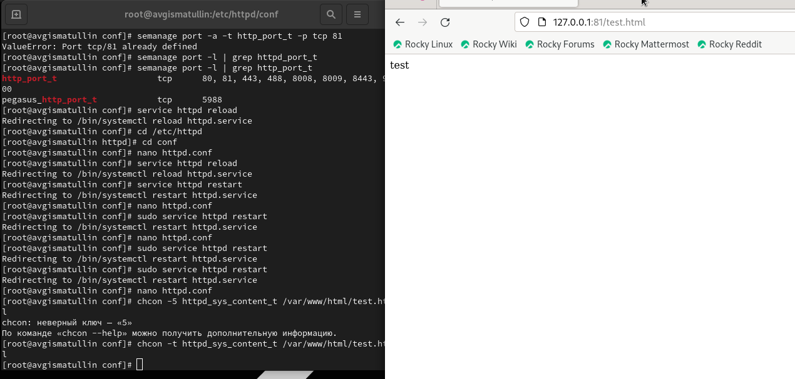{ #fig:014 width=70%, height=70% }

15. Удалим привязку контекста файла к порту 81, а также сам html файлов (рис. [-@fig:015])

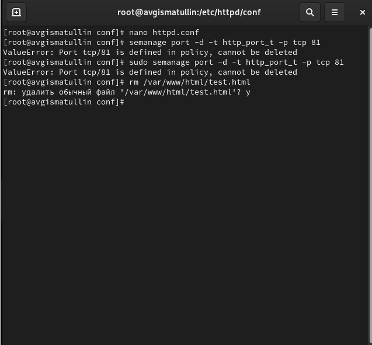{ #fig:015 width=70%, height=70% }

# Выводы
В ходе выполнения данной лабораторной работы были развиты навыки администрирования ОС Linux, а также проверена работа SELinx на практике совместно с веб-сервером Apache.

# Список литературы{.unnumbered}

1. [Теория разграничения прав пользователей](https://moodle.kstu.ru/pluginfile.php/318215/mod_resource/content/1/Теория_разграничение_прав_пользователи.pdf)
2. [Разрешения доступа к файлам](https://linuxcommand.ru/razresheniya-dostupa-k-failam/)
