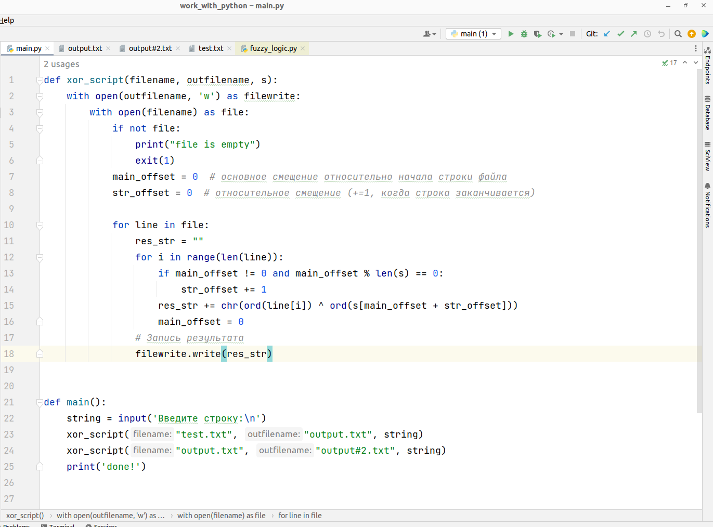
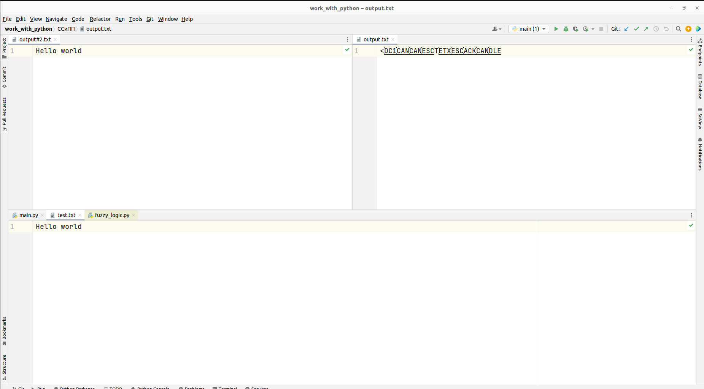

---
## Front matter
title: "Отчет по лабораторной работе №7"
subtitle: "Элементы криптографии. Однократное гаммирование"
author: "Гисматуллин Артём Вадимович НПИбд-01-22"

## Generic otions
lang: ru-RU
toc-title: "Содержание"

## Bibliography
bibliography: bib/cite.bib
csl: pandoc/csl/gost-r-7-0-5-2008-numeric.csl

## Pdf output format
toc: true # Table of contents
toc-depth: 2
lof: true # List of figures
lot: true # List of tables
fontsize: 12pt
linestretch: 1.5
papersize: a4
documentclass: scrreprt
## I18n polyglossia
polyglossia-lang:
  name: russian
  options:
	- spelling=modern
	- babelshorthands=true
polyglossia-otherlangs:
  name: english
## I18n babel
babel-lang: russian
babel-otherlangs: english
## Fonts
mainfont: PT Serif
romanfont: PT Serif
sansfont: PT Sans
monofont: PT Mono
mainfontoptions: Ligatures=TeX
romanfontoptions: Ligatures=TeX
sansfontoptions: Ligatures=TeX,Scale=MatchLowercase
monofontoptions: Scale=MatchLowercase,Scale=0.9
## Biblatex
biblatex: true
biblio-style: "gost-numeric"
biblatexoptions:
  - parentracker=true
  - backend=biber
  - hyperref=auto
  - language=auto
  - autolang=other*
  - citestyle=gost-numeric
## Pandoc-crossref LaTeX customization
figureTitle: "Рис."
tableTitle: "Таблица"
listingTitle: "Листинг"
lofTitle: "Список иллюстраций"
lotTitle: "Список таблиц"
lolTitle: "Листинги"
## Misc options
indent: true
header-includes:
  - \usepackage{indentfirst}
  - \usepackage{float} # keep figures where there are in the text
  - \floatplacement{figure}{H} # keep figures where there are in the text
---

# Цель работы

 - Освоить на практике применение режима однократного гаммирования

# Задание

Последовательно выполнять все пункты, занося ответы и замечания в отчет.

# Выполнение лабораторной работы
 
1. Пропишем две функции на языке Python, где у нас будет находится приложение-шифратор-дешифратор. Функция main получает на вход данные о строке, файлах и отправляет в функцию xor_script, где производится операция XOR \ каждым символом из файла filename и строкой s. Если символов в файле больше, чем в строке s, то строка сдвигается влево на один символ. Результат записывается в файл outfilename (рис. [-@fig:001])

{ #fig:001 width=70%, height=70% }

2. Получаем следующий вывод (названия файлов выделены) (рис. [-@fig:002])

{ #fig:002 width=70%, height=70% }

# Выводы

В ходе выполнения данной лабораторной работы были освоены на практике методы однократного гаммирования

# Список литературы{.unnumbered}

1. [Шифрование методом гаммирования](http://altaev-aa.narod.ru/security/XOR.html)
2. [Режим гаммирования в облочном алгоритме шифрования](https://kabinfo.ucoz.ru/index/shifr_reshetka_kardano/0-374)
